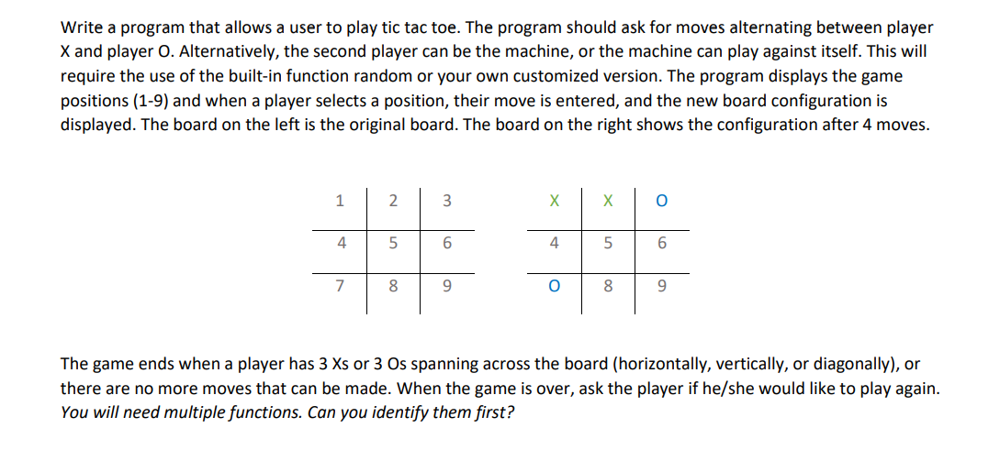

# TIC TAC TOE

This is a project created for the 'Algorithm & Programming' course at LaSalle College

## Table of contents

- [Overview](#overview)
  - [Project Question](#project-question)
  - [Useful resources](#useful-resources)
- [Authors](#authors)

## Overview

### Project Question

Users should be able to:

- Choose between X and O
- See the board after each move 
- See the results - Win or Tie match

### Useful resources

- [Return 2 values from a function](https://www.geeksforgeeks.org/how-to-return-multiple-values-from-a-function-in-c-or-cpp/) - This helped us to return 2 values from a function in different ways. 

## Authors

- Varun Grover - [@thevarungrovers](https://www.github.com/thevarungrovers)
- Kavita - [@kavitachahota](https://github.com/kavitachahota)

